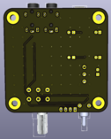

# Music mini-amplifier with indicator:  
A simple two-channel amplifier on a chip TDA2822 with indicator.  

### Schemes:  
###### Amplifier_v0.1:  
[pdf](amplifier/docs/mahp_v0.1.pdf)  
###### Indicator_v0.1:  
[pdf](indicator/docs/indicator_v0.1.pdf)  

### Images:  
###### Amplifier_v0.1:  
top:  
  
bottom:  
  

###### Indicator_v0.1:  
top:  
  
bottom:  
  

###### gerber:  
Archive for production:  
[Amplifier_v0.1](https://github.com/piro-s/music_amplifier/raw/master/amplifier/gerber/mahp_v0.1.zip)  
[Indicator_v0.1](https://github.com/piro-s/music_amplifier/raw/master/indicator/gerber/indicator_v0.1.zip)  